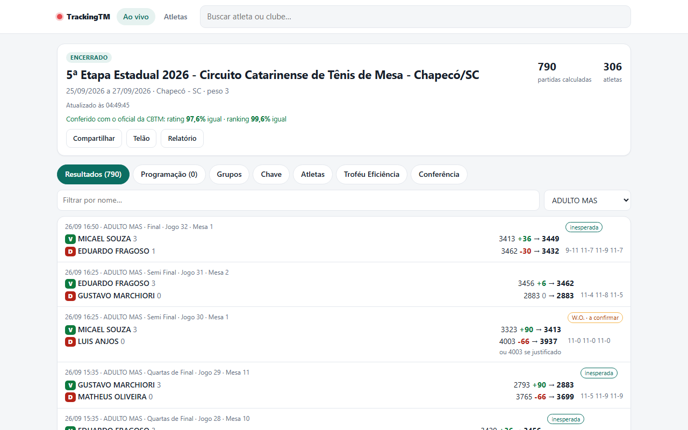
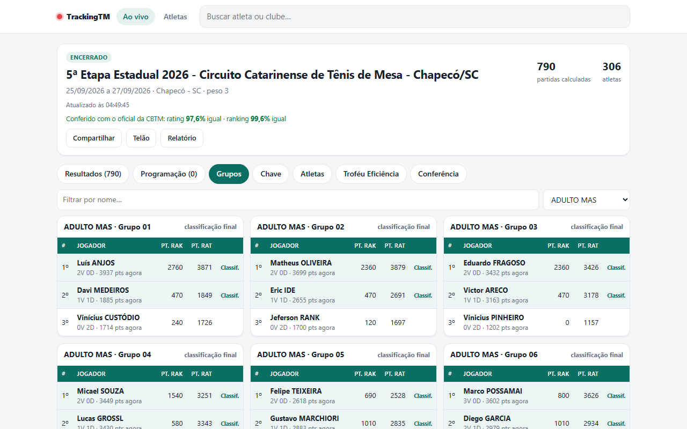
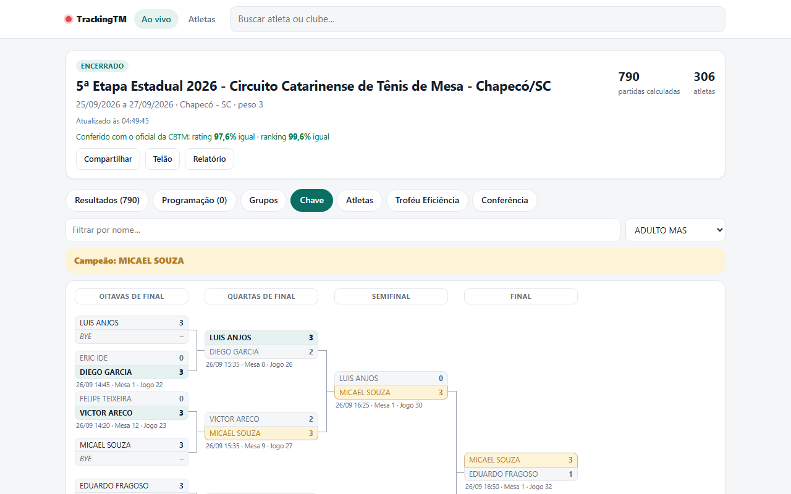
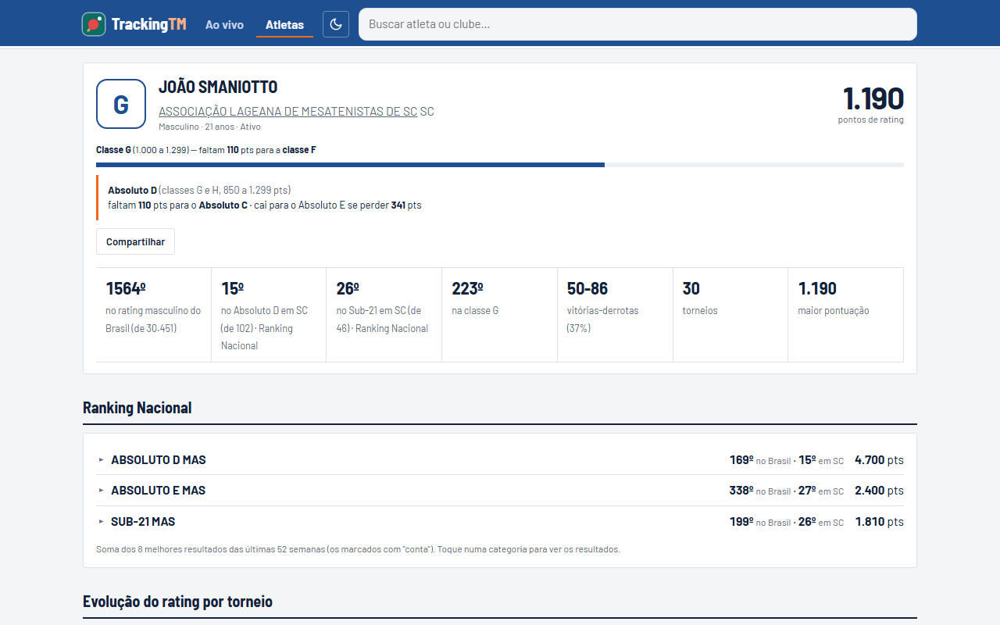
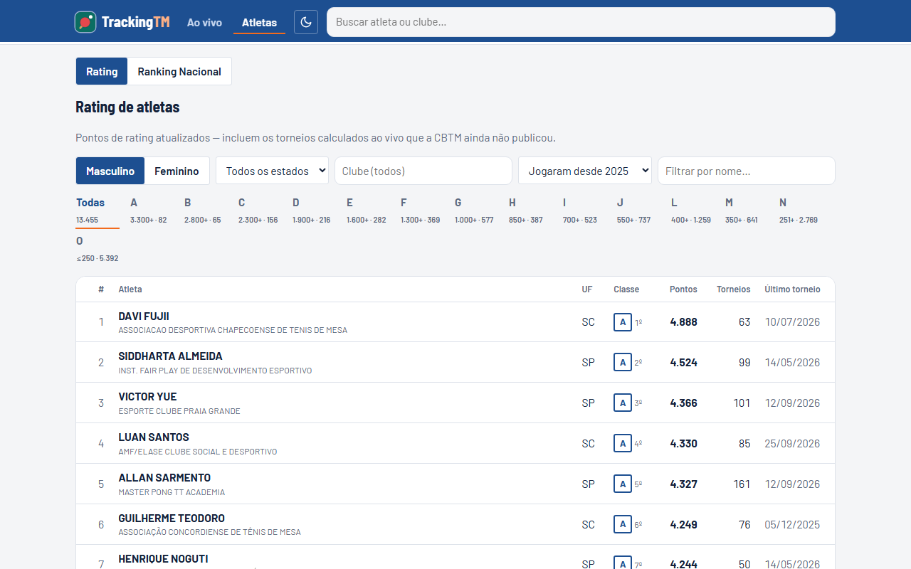
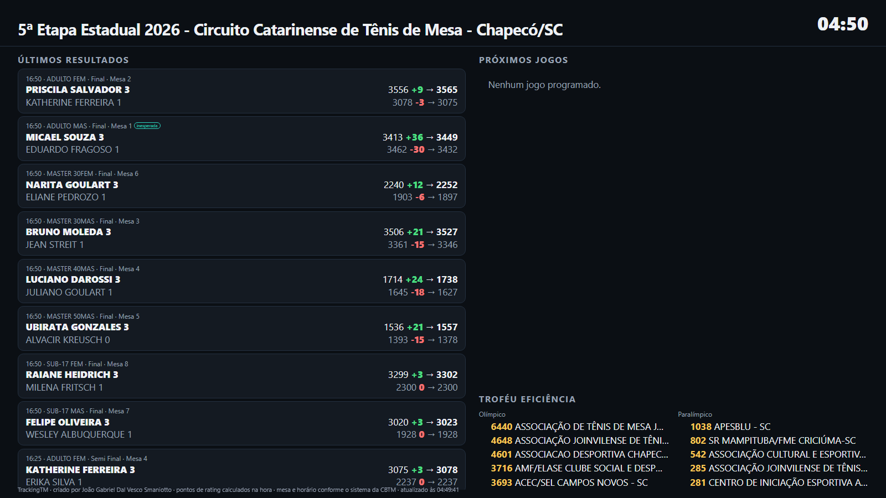
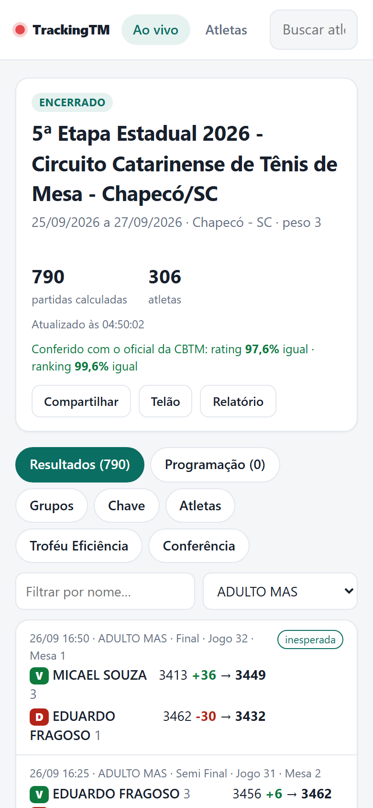
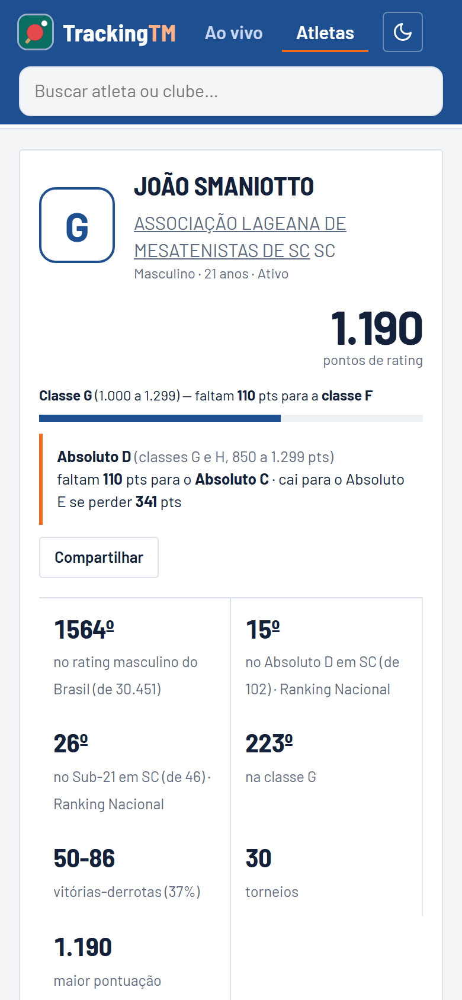

# TrackingTM

**Rating e ranking de tênis de mesa, atualizados logo após cada partida.**

Acesse: **[trackingtm.com.br](https://trackingtm.com.br)**

O TrackingTM acompanha os torneios do calendário da CBTM (nacionais, estaduais e regionais de todos os estados) e calcula, partida a partida, o rating e o Ranking Nacional de cada atleta. Durante o torneio, atletas, técnicos e familiares veem no celular quantos pontos cada jogo valeu e com quantos pontos o atleta entra na próxima partida.

---

## O que o sistema faz

### Torneio ao vivo
- **Resultados** partida a partida, com os pontos de rating ganhos e perdidos por cada atleta e a indicação de vitória **inesperada**.
- **Programação** dos próximos jogos, com a projeção de quanto cada atleta ganha ou perde conforme o resultado.
- **Tabela dos grupos**, com a classificação e os classificados.
- **Chave do mata-mata**, das primeiras rodadas até a final, com placar, data, horário e mesa.
- **Troféu Eficiência** por clube, olímpico e paralímpico, atualizado durante o torneio.
- **Conferência com o oficial:** depois que os resultados oficiais são publicados, o sistema compara automaticamente o cálculo com o oficial, atleta por atleta.

| Tabela dos grupos | Chave do mata-mata |
|---|---|
|  |  |

### Atletas
- **Perfil completo:** classe de rating, quanto falta para subir de classe e de Absoluto, posição no ranking, gráfico da evolução, histórico de partidas, rivais e confronto direto.
- **Ranking Nacional** por categoria, com a soma dos 8 melhores resultados das últimas 52 semanas, incluindo o torneio em andamento.
- **Ranking de rating** com filtros por sexo, classe, estado e clube.

| Perfil do atleta | Ranking |
|---|---|
|  |  |

### Para organizadores e clubes
- **Telão** para a TV do ginásio: últimos resultados, próximos jogos com a mesa em destaque e o Troféu Eficiência, atualizado sozinho.
- **Relatório do evento** pronto para imprimir ou salvar em PDF: números, pódio, troféu e destaques.
- **Página do clube** no torneio: atletas, colocações, medalhas e posição no troféu.
- **Calendário** de todos os estados, com os próximos torneios.

### Feito para o celular

| Torneio | Perfil |
|---|---|
|  |  |

---

## Como os pontos são calculados

O cálculo segue os regulamentos de rating e ranking da CBTM:

- A diferença de pontos entre os dois atletas define o valor da partida na tabela oficial, para vitória **esperada** ou **inesperada**.
- O valor é multiplicado pelo **peso do torneio** (Brasileiro, Seletiva, Copa Brasil Ouro e Prata, Estadual, Regional).
- As partidas são processadas em ordem de data e horário: cada jogo usa os pontos atualizados pelo anterior, inclusive entre categorias.
- O Ranking Nacional soma os 8 melhores resultados das últimas 52 semanas, com os pontos de cada colocação.

Na 5ª Etapa Estadual de Santa Catarina (Chapecó, 2026), a conferência automática com o oficial deu **97,6% de igualdade no rating e 99,6% no ranking**.

Guia completo de uso: [Guia_TrackingTM.pdf](Guia_TrackingTM.pdf)

---

## Criador

**João Gabriel Dal Vesco Smaniotto**, idealização e desenvolvimento.

- E-mail: [jgdalvesco@gmail.com](mailto:jgdalvesco@gmail.com)
- WhatsApp: [+55 (49) 98505-6650](https://wa.me/5549985056650)

Dúvidas, sugestões ou interesse em usar o sistema no seu torneio ou federação: fale comigo.

---

O TrackingTM é um projeto independente e **não é um site oficial da CBTM**. Os pontos seguem os regulamentos de rating e ranking; em caso de diferença, vale o oficial da CBTM.

Este repositório apresenta o sistema; o código-fonte não é público.
© 2026 João Gabriel Dal Vesco Smaniotto. Todos os direitos reservados.
